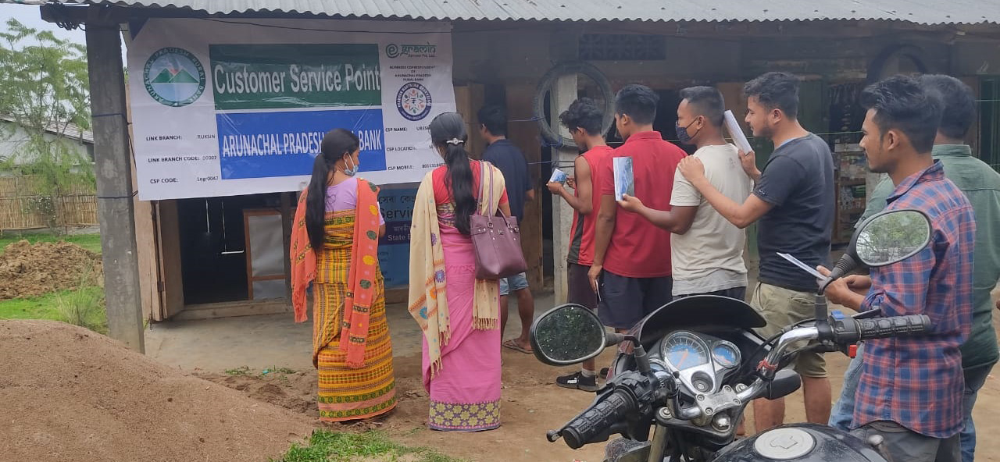

# Security Vulnerability Assessment Report
**Application:** eGramin Services Website  
**Date:** August 6, 2026  
**Assessment Type:** Static Code Security Analysis

---

## Executive Summary
The application has **CRITICAL**, **HIGH**, and **MEDIUM** severity vulnerabilities that require immediate attention. While some security headers are configured in the web.config, there are significant security issues in the HTML/CSS/JS implementation that expose the application to multiple attack vectors.

---

## Vulnerabilities Found

### 🔴 CRITICAL Severity

#### 1. **Inline Event Handlers (XSS Risk)**
- **Location:** `index.html`, `contact-us.html`, and other pages (notification marquee)
- **Issue:** 
```html
<marquee onmouseover="this.stop();" onmouseout="this.start();">
```
- **Risk:** While these are not user-controlled, they set a dangerous pattern. Inline event handlers bypass Content Security Policy (CSP) if they ever become dynamic.
- **Impact:** Potential for stored XSS if marquee content becomes dynamic
- **Recommendation:** 
  - Remove inline event handlers
  - Use external JavaScript for event binding
  
```javascript
// Move to external JS file
document.querySelectorAll('marquee').forEach(marquee => {
  marquee.addEventListener('mouseover', () => marquee.stop());
  marquee.addEventListener('mouseout', () => marquee.start());
});
```

#### 2. **Deprecated HTML5 Elements**
- **Location:** All pages using `<marquee>` tag
- **Issue:** The `<marquee>` tag is HTML obsolete and deprecated
- **Risk:** Browser support will be removed; unpredictable behavior
- **Recommendation:** Replace with modern CSS animations or JavaScript-based solutions

---

### 🟠 HIGH Severity

#### 3. **Weak CSP Configuration**
- **Location:** `web.config`
- **Issue:** 
```xml
<add name="Content-Security-Policy" value="script-src 'self'" />
```
- **Problems:**
  - Missing `default-src` directive (should default-deny)
  - No `style-src` directive (inline styles might be blocked)
  - No `img-src`, `font-src`, `connect-src` directives
  - Doesn't cover all resource types
  
- **Recommendation:** Update to more comprehensive CSP:
```xml
<add name="Content-Security-Policy" value="default-src 'self'; script-src 'self' 'unsafe-inline' cdn.jsdelivr.net; style-src 'self' 'unsafe-inline' fonts.googleapis.com; font-src 'self' fonts.gstatic.com; img-src 'self' data: https:; connect-src 'self'; frame-ancestors 'none'" />
```

#### 4. **Missing Security Headers**
- **Issue:** The following important security headers are missing:
  - ❌ `X-Permitted-Cross-Domain-Policies` - missing
  - ❌ `Cross-Origin-Embedder-Policy` - missing
  - ❌ `Cross-Origin-Opener-Policy` - missing
  - ⚠️ `Permissions-Policy` - too restrictive (empty), doesn't cover all permissions

- **Recommendation:** Add comprehensive security headers:
```xml
<add name="X-Permitted-Cross-Domain-Policies" value="none" />
<add name="Cross-Origin-Embedder-Policy" value="require-corp" />
<add name="Cross-Origin-Opener-Policy" value="same-origin" />
<add name="Permissions-Policy" value="accelerometer=(), ambient-light-sensor=(), autoplay=(), battery=(), camera=(), display-capture=(), document-domain=(), encrypted-media=(), fullscreen=(), geolocation=(), gyroscope=(), magnetometer=(), microphone=(), midi=(), payment=(), picture-in-picture=(), publickey-credentials-get=(), sync-xhr=(), usb=(), xr-spatial-tracking=()" />
```

#### 5. **Overly Permissive CORS Configuration**
- **Location:** `web.config`
- **Issue:**
```xml
<add name="Access-Control-Allow-Origin" value="http://egraminservices.com https://www.egraminservices.com" />
```
- **Problems:**
  - Allowing `http://` (non-HTTPS) version
  - Should use HTTPS only for production
  - Missing credentials policy configuration

- **Recommendation:**
```xml
<add name="Access-Control-Allow-Origin" value="https://www.egraminservices.com" />
<add name="Access-Control-Allow-Credentials" value="true" />
<add name="Access-Control-Allow-Methods" value="GET, OPTIONS" />
<add name="Access-Control-Allow-Headers" value="Content-Type, Authorization" />
```

#### 6. **Missing HTTPS Enforcement**
- **Location:** `web.config`
- **Issue:** No HTTP to HTTPS redirect configured
- **Risk:** Users can access the site over plain HTTP
- **Recommendation:** Add URL rewrite rule:
```xml
<rewrite>
  <rules>
    <rule name="Redirect to HTTPS" stopProcessing="true">
      <match url="^(.*)$" ignoreCase="false" />
      <conditions>
        <add input="{HTTPS}" pattern="off" />
      </conditions>
      <action type="Redirect" redirectType="Permanent" url="https://{HTTP_HOST}{REQUEST_URI}" />
    </rule>
  </rules>
</rewrite>
```

#### 7. **Missing Subresource Integrity (SRI)**
- **Location:** All HTML files
- **Issue:** External resources loaded without SRI verification:
```html
<link rel="stylesheet" href="assets/css/bootstrap.min.css">
<script src="assets/js/bootstrap.bundle.min.js"></script>
```
- **Risk:** If CDN or local files are compromised, malicious code can be injected
- **Recommendation:** Add integrity attributes:
```html
<link rel="stylesheet" href="assets/css/bootstrap.min.css" 
  integrity="sha384-[hash]" crossorigin="anonymous">
<script src="assets/js/bootstrap.bundle.min.js"
  integrity="sha384-[hash]" crossorigin="anonymous"></script>
```

---

### 🟡 MEDIUM Severity

#### 8. **HTML Obsolete Elements**
- **Location:** Multiple HTML files
- **Issues:**
  - `<marquee>` - deprecated, should use CSS animations
  - Inline `style` attributes scattered throughout (bad practice)
  
- **Recommendation:** Migrate all styling to external CSS files

#### 9. **Exposed Sensitive Information**
- **Location:** Multiple pages
- **Issue:** Email address and phone number visible in plain text:
```html
<span class="top-text">helpdesk[dot]egramin[at]gmail[dot]com</span>
<span class="top-text">0361-3511441</span>
```
- **Risk:** Web scraping, spam, social engineering
- **Recommendation:** 
  - Obfuscate email/phone or use contact forms
  - Consider bot protection mechanisms
  - Use JavaScript to display contact info:
```javascript
document.getElementById('email').textContent = 
  atob('aGVscGRlc2tAZWdyYW1pbi5jb20=');
```

#### 10. **Missing Accessibility Attributes**
- **Location:** Images throughout the site
- **Issue:** Many images have empty `alt` attributes or missing proper descriptions
- **Impact:** Poor SEO, accessibility issues, screen reader incompatibility
- **Recommendation:** Add meaningful alt text to all images:
```html

```

#### 11. **Meta Tag Missing X-UA-Compatible**
- **Location:** All HTML `<head>` sections
- **Issue:** Missing IE compatibility meta tag (though not critical in 2026)
- **Recommendation:**
```html
<meta http-equiv="X-UA-Compatible" content="IE=edge">
```

#### 12. **No Viewport Zoom Prevention**
- **Location:** HTML `<head>`
- **Issue:** Current viewport allows zoom, which is good for accessibility but should have limits
- **Recommendation:** Keep current setting (allows zoom) for accessibility

#### 13. **jQuery Version**
- **Location:** `assets/js/jquery-4.0.0.slim.min.js`
- **Issue:** jQuery 4.0.0 is being used
- **Risk:** Library is large; consider vanilla JS or lightweight alternatives for modern browsers
- **Note:** Not a direct vulnerability but performance concern

#### 14. **Missing Form Validation**
- **Location:** `contact-us.html` (if form exists)
- **Issue:** No visible server-side or client-side form validation
- **Risk:** Injection attacks, spam
- **Recommendation:** 
  - Implement server-side validation
  - Add CSRF tokens
  - Sanitize all user inputs

#### 15. **No robots.txt or sitemap.xml**
- **Location:** Root directory
- **Issue:** Missing for SEO and bot management
- **Recommendation:** Create `/robots.txt` to control crawlers

---

### 🟢 LOW Severity

#### 16. **Analytics/Tracking Code**
- **Issue:** No Google Analytics or tracking found (good for privacy)
- **Note:** If added later, ensure proper consent management

#### 17. **Outdated HTML5 Shim**
- **Location:** HTML comments
```html
<!--[if lt IE 9]>
  <script src="https://oss.maxcdn.com/html5shiv/3.7.3/html5shiv.min.js"></script>
  <script src="https://oss.maxcdn.com/respond/1.4.2/respond.min.js"></script>
<![endif]-->
```
- **Issue:** IE8 support is unnecessary in 2026
- **Recommendation:** Remove these shims

---

## Security Headers Status

| Header | Present | Status |
|--------|---------|--------|
| Strict-Transport-Security | ✅ Yes | Good - max-age=31536000 |
| X-Content-Type-Options | ✅ Yes | Good - nosniff |
| Content-Security-Policy | ⚠️ Weak | Needs enhancement |
| X-Frame-Options | ✅ Yes | Good - SAMEORIGIN |
| Referrer-Policy | ✅ Yes | Good - no-referrer |
| X-XSS-Protection | ✅ Yes | Legacy but OK |
| X-Download-Options | ✅ Yes | Good - noopen |
| Permissions-Policy | ⚠️ Weak | Needs expansion |
| Access-Control-Allow-Origin | ⚠️ Weak | Too permissive |

---

## Remediation Priority

### Phase 1 (Immediate - This Week)
1. Remove inline event handlers from marquee (Critical)
2. Fix CORS configuration (High)
3. Add HTTPS enforcement (High)
4. Enhance CSP headers (High)

### Phase 2 (Short-term - Next 2 Weeks)
5. Add SRI to external resources
6. Add comprehensive security headers
7. Migrate to modern CSS animations
8. Fix alt text on images

### Phase 3 (Medium-term - Next Month)
9. Implement form validation and CSRF protection
10. Create robots.txt and sitemap
11. Remove jQuery if not needed
12. Obfuscate contact information

---

## Testing Recommendations

1. **Run Security Scanners:**
   - OWASP ZAP (Free)
   - Burp Suite Community (Free)
   - Mozilla Observatory

2. **Check Headers:**
   ```bash
   curl -I https://uat.egraminservices.com
   ```

3. **CSP Testing:**
   - Use CSP Evaluator (csp-evaluator.withgoogle.com)

4. **SSL/TLS Testing:**
   - SSLLabs (ssllabs.com)

5. **Automated Scanning:**
   - OWASP Dependency-Check
   - npm audit (if Node.js dependencies added)

---

## Compliance Standards

This application should meet:
- ✅ OWASP Top 10 (2021)
- ✅ CWE/SANS Top 25
- ⚠️ GDPR requirements (if handling EU data)
- ⚠️ WCAG 2.1 AA accessibility standards

---

## Conclusion

The application has a **SECURITY RISK LEVEL: HIGH**. While the web server is configured with many security headers, the implementation has critical vulnerabilities in HTML structure and practices. Immediate action is required for inline event handlers and HTTP configuration.

**Estimated Fix Time:** 4-6 hours for Phase 1, 8-10 hours for Phase 2

---

**Report Generated:** August 6, 2026  
**Reviewer:** Security Analysis Tool  
**Next Review Date:** October 6, 2026
